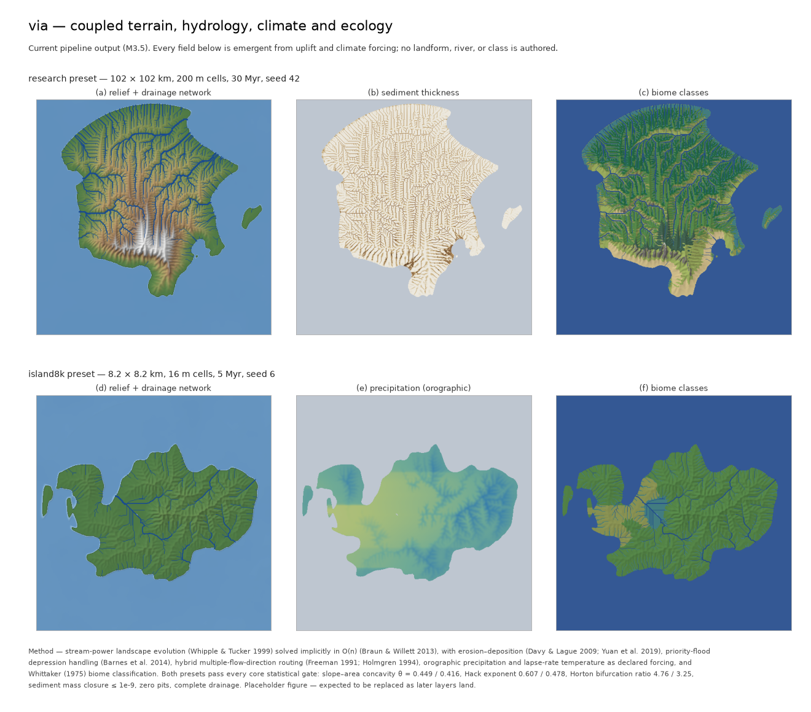

# via

*Latin **via** — road, way; by way of.*

**via** is a research project on the end-to-end simulation of inhabited landscapes: terrain, hydrology, economics, transport, settlement growth, and building placement modeled as **one causal system**, rather than as independent generators composited after the fact.



<sub>Output of the natural-substrate stages as of M3.5; the M4 lithology layer is not yet pictured. Placeholder figure — it will be replaced as later layers land.</sub>

## Motivation

Procedural generation has produced excellent single-layer results. Landscape evolution models synthesize terrain with physically correct drainage; tensor-field and grammar-based methods generate street networks with convincing local geometry; shape grammars fill blocks with buildings. Each is strong in isolation — and each, in isolation, is insufficient for a real-world-like setup.

A believable place is not a stack of layers. It is the *record of processes that shaped each other*. When layers are generated independently, the result fails at the seams:

- rivers that no settlement acknowledges — towns centered on nothing: no ford, no harbour, no confluence
- roads classified "highway" that no traffic pattern would ever justify
- roads that always go *around* mountains, because "tunnel" was never a possible answer — the generator only knows the ground surface
- street grids with no history: no promoted-then-bypassed high street, no station road cut toward a market square, no fringe belts
- networks whose topology ignores the topology of the habitable land itself

These are not failures of fidelity. They are failures of **coupling**. Believability lives in the seams.

## Thesis

> The believability of a generated world is dominated by the causal consistency *between* its layers, not by the fidelity of any single layer.

Four commitments follow:

1. **Terrain first.** Terrain is the only layer causally upstream of everything and downstream of nothing. Elevation determines hydrology; hydrology determines suitability; suitability determines where people can be at all. A heightfield without a correct drainage network poisons every layer above it.
2. **Structure from economics.** Whether a road runs at grade, in a cutting, over a viaduct, or through a tunnel is the argmin of a cost function — capital cost against discounted user cost — not a stylistic rule. A tunnel should *emerge* where traffic, detour length, and terrain make it worth boring, and nowhere else.
3. **Class from flow, not declaration.** Road hierarchy, settlement hierarchy, and land use are measurements on simulated demand (gravity models, equilibrium assignment, centrality), never authored labels. Anything hand-authored is a bug surface; where the simulation cannot honor a constraint, the discrepancy is recorded, not absorbed.
4. **Time is first-class.** Real networks carry history: routes precede the settlements that grow at their break-of-bulk points; streets are promoted, widened, bypassed, and demoted; city radius tracks the speed of the dominant transport mode. A single-pass generator cannot produce a fossil record. An epochal one can.

## The causal chain

```
uplift / climate
   └─ terrain ── hydrology (drainage, flood, coast)
        └─ suitability & affordances (harbours, fords, confluences, passes)
             └─ corridors (least-cost, multi-modal: at-grade | cut | fill | viaduct | tunnel)
                  └─ settlement seeds at network nodes ── population (rank-size)
                       └─ demand (gravity) ── flows (assignment) ── network class
                            └─ growth epochs (promotion, bypass, demotion, fringe belts)
                                 └─ morphology (blocks, plots) ── placement (buildings)
```

Every arrow is one-directional; each level is a boundary condition for the next. The simulation runs at a much larger extent than any deliverable — regional flows are computed on the full graph and only then windowed, because centrality on a clipped graph is not an approximation of centrality on the full graph; it is a different quantity. Interesting regions are *selected by measurement* (detour ratio, affordance diversity, tier span, structural diversity), not specified in advance.

## Relation to prior work

We build directly on, and do not replicate, three mature bodies of work:

- **Terrain / landscape evolution** — stream-power erosion and drainage extraction (Braun & Willett 2013; Génevaux et al. 2013; Cordonnier et al. 2016). Produces correct landforms; says nothing about who lives on them.
- **Network generation** — L-systems seeded by population maps (Parish & Müller 2001), tensor-field streets (Chen et al. 2008), cost-based road alignment with emergent bridges and tunnels (Galin et al. 2010, 2011). Produces convincing geometry; the demand that should shape it is usually absent or synthetic.
- **Urban simulation** — land-use/transport interaction and agent-based models (UrbanSim, MATSim; Weber et al. 2009; Vanegas et al. 2009–2012). Rich process models, rarely coupled to synthesized terrain or to game-ready output.

Each community treats the others' output as an exogenous given. **via** is about the composition: a single pipeline in which the terrain community's landforms carry the urban community's processes and emit the graphics community's geometry — with the seams as the object of study.

## Research questions

- Can functional class be *derived* (flow → class) at every scale, from footpath to motorway, with distributions matching real networks?
- Do bridges and tunnels emerge from cost minimization alone at plausible frequencies and locations — the chord through the ridge appearing only when an era's traffic justifies it?
- Does network topology track the topology of the habitable set without archetype rules — the coastal ring on an annular island, the mesh on a habitable disc, the ribbon in a valley — and does it *fail* correctly (open horseshoes where a cliff coast interrupts)?
- Can epochal growth produce a legible fossil record — demoted arterials, station streets, concentric grain changes — distinguishable by a reader from single-pass output?
- Which statistics separate real places from generated ones (orientation entropy, block-size and detour distributions, rank-size fit, space-syntax measures), and can they serve as gates rather than post-hoc evaluation?

## Status

Early. The **natural substrate** — the part of the chain upstream of people — is built and gated; nothing downstream of suitability has started. Nothing here is final except the thesis.

Complete, with every core statistical gate passing at both calibration scales (102 km / 200 m and 8.2 km / 16 m):

- **Terrain** — stream-power landscape evolution, implicit O(n) solve, priority-flood depression handling ([ADR 0001](docs/adr/0001-crate-layout-and-artifact-format.md))
- **Climate & ecology** — orographic precipitation and lapse-rate temperature as forcing, erosion on precipitation-weighted discharge, Whittaker biome classes and vegetation spectra ([ADR 0002](docs/adr/0002-climate-coupling-and-ecology-stage.md))
- **Sediment & standing water** — erosion–deposition, lakes as an emergent diagnosis, bedrock/sediment bookkeeping under a mass-closure gate ([ADR 0004](docs/adr/0004-sediment-and-standing-water.md))
- **Flow routing** — hybrid multiple-flow-direction routing, converging in channels ([ADR 0005](docs/adr/0005-mfd-routing.md)); the coupled erosion–deposition term solved as one implicit fixed point ([ADR 0006](docs/adr/0006-implicit-erosion-deposition.md))
- **Lithology & structure** — a deformed stratigraphic column as declared forcing, per-unit erodibility and diffusivity through the solve, karst potential as a spectrum ([ADR 0007](docs/adr/0007-lithology-and-structure.md))

The working doctrine is recorded in [ADR 0003](docs/adr/0003-epistemic-tiers.md): process (gated), forcing (declared in config), and interpretation (optional, labeled) are separate tiers, outputs are spectra rather than authored taxonomy, and modules never encode a practical use case. Planned layers are in the [roadmap](docs/ROADMAP.md); recurring design questions and the known limitations behind them are tracked in the [FAQ](docs/faq/README.md).

## Reading list

**via** sits at the junction of literatures that rarely cite one another: geomorphology, computer graphics, transport engineering, urban economics, urban morphology, and network science. No contributor needs command of all of them. Every contributor should have read the ★ spine — roughly a dozen items that define the project's vocabulary — and should know which shelf to open when their subsystem touches a neighboring field. Sections follow the causal chain.

### Terrain & hydrology

- Whipple, K. X., Tucker, G. E. (1999). *Dynamics of the stream-power river incision model.* J. Geophysical Research. — The governing equation of fluvial landscapes; the `K·Aᵐ·Sⁿ` term any erosion stage integrates.
- Braun, J., Willett, S. D. (2013). *A very efficient O(n), implicit and parallel method to solve the stream power equation.* Geomorphology. — The algorithm that made landscape evolution cheap enough to sit inside a content pipeline.
- Génevaux, J.-D., Galin, E., Guérin, E., Peytavie, A., Benes, B. (2013). *Terrain Generation Using Procedural Models Based on Hydrology.* SIGGRAPH. — Builds terrain *from* the drainage network rather than hoping one emerges; the strongest statement of hydrology-first.
- Cordonnier, G., Braun, J., Cani, M.-P., et al. (2016). *Large Scale Terrain Generation from Tectonic Uplift and Fluvial Erosion.* Eurographics. — Uplift and erosion as the generative pair, at interactive rates.
- ★ Galin, E., Guérin, E., Peytavie, A., et al. (2019). *A Review of Digital Terrain Modeling.* Eurographics STAR / CGF 38(2). — The field map; read before proposing any terrain feature.
- Barnes, R., Lehman, C., Mulla, D. (2014). *Priority-flood: an optimal depression-filling and watershed-labeling algorithm.* Computers & Geosciences. — Depression handling done right; the difference between rivers and puddles.
- Tarboton, D. G. (1997). *A new method for the determination of flow directions and upslope areas in grid DEMs.* Water Resources Research. — D∞ flow routing; upstream area feeds both rivers and affordances.
- Jasiewicz, J., Stepinski, T. (2013). *Geomorphons — a pattern recognition approach to classification of landforms.* Geomorphology. — Landform classification from local patterns; useful for suitability, land cover, and region scoring.

### Procedural modeling (computer graphics)

- ★ Parish, Y. I. H., Müller, P. (2001). *Procedural Modeling of Cities.* SIGGRAPH. — The founding paper: L-system roads steered by population maps; every generator since is in dialogue with it.
- Chen, G., Esch, G., Wonka, P., Müller, P., Zhang, E. (2008). *Interactive Procedural Street Modeling.* SIGGRAPH. — Tensor fields for street orientation; the standard answer for local grain, silent on demand.
- ★ Galin, E., Peytavie, A., Maréchal, N., Guérin, E. (2010). *Procedural Generation of Roads.* CGF 29(2). — Roads as anisotropic shortest paths, with bridges and tunnels emerging from the cost function; the closest single antecedent to commitment 2.
- Galin, E., Peytavie, A., Guérin, E., Benes, B. (2011). *Authoring Hierarchical Road Networks.* CGF 30(7). — The same machinery extended from one road to a network.
- Weber, B., Müller, P., Wonka, P., Gross, M. (2009). *Interactive Geometric Simulation of 4D Cities.* Eurographics. — Growth simulated through time with traffic in the loop; the closest antecedent to commitment 4.
- Vanegas, C. A., Aliaga, D., Benes, B., Waddell, P. (2009). *Interactive Design of Urban Spaces using Geometrical and Behavioral Modeling.* SIGGRAPH Asia. — Couples urban geometry to a behavioral model rather than compositing them.
- Vanegas, C. A., Garcia-Dorado, I., Aliaga, D., et al. (2012). *Inverse Design of Urban Procedural Models.* SIGGRAPH Asia. — Solve for generator inputs that produce desired outputs; the complement of via's generate-and-select.
- Emilien, A., Bernhardt, A., Peytavie, A., Cani, M.-P., Galin, E. (2012). *Procedural Generation of Villages on Arbitrary Terrains.* The Visual Computer. — Settlement seeding and growth under terrain constraint at the village scale.
- Müller, P., Wonka, P., Haegler, S., Ulmer, A., Van Gool, L. (2006). *Procedural Modeling of Buildings.* SIGGRAPH. — The CGA shape grammar; the placement layer's lingua franca.
- Smelik, R., Tutenel, T., Bidarra, R., Benes, B. (2014). *A Survey on Procedural Modelling for Virtual Worlds.* CGF 33(6). — The survey; know what exists before writing a generator.

### Transport modeling, economics & land use

- Wardrop, J. G. (1952). *Some Theoretical Aspects of Road Traffic Research.* Proc. Institution of Civil Engineers. — The two equilibrium principles; the fixed point every assignment stage seeks.
- Beckmann, M., McGuire, C. B., Winsten, C. B. (1956). *Studies in the Economics of Transportation.* Yale. — Equilibrium assignment as convex optimization; the mathematical foundation under Wardrop.
- Sheffi, Y. (1985). *Urban Transportation Networks.* Prentice-Hall. — The assignment textbook (Frank–Wolfe, volume-delay functions); freely available from the author.
- ★ Ortúzar, J. de D., Willumsen, L. G. (2011). *Modelling Transport*, 4th ed. Wiley. — The four-step canon: generation, distribution, mode choice, assignment.
- Hansen, W. G. (1959). *How Accessibility Shapes Land Use.* JAPA. — The accessibility measure; the hinge between networks and land use.
- Small, K., Verhoef, E. (2007). *The Economics of Urban Transportation.* Routledge. — Value of time, congestion, appraisal; where user cost gets its numbers.
- UK Department for Transport. *Transport Analysis Guidance (TAG).* — A complete, maintained appraisal framework: values of time, discounting, benefit–cost machinery, all in the open.
- ★ Marchetti, C. (1994). *Anthropological Invariants in Travel Behavior.* Technological Forecasting & Social Change. — The one-hour travel budget: city radius ≈ mode speed × ½ hour; via's growth law.
- Lowry, I. S. (1964). *A Model of Metropolis.* RAND. — The first operational land-use/transport model; every LUTI system descends from it.
- Wegener, M. (2004). *Overview of Land-Use Transport Models.* In Handbook of Transport Geography and Spatial Systems. — The LUTI family tree.
- Waddell, P. (2002). *UrbanSim: Modeling Urban Development for Land Use, Transportation, and Environmental Planning.* JAPA. — Microsimulated land use coupled to transport; open source.
- Horni, A., Nagel, K., Axhausen, K. W., eds. (2016). *The Multi-Agent Transport Simulation MATSim.* Ubiquity Press. — Agent-based assignment at scale; open access, open source.

### Location theory & urban economics

- ★ von Thünen, J. H. (1826). *The Isolated State.* — Land use as rings of bid rent around a market; the oldest formal spatial model and still the cleanest.
- ★ Christaller, W. (1933; trans. 1966). *Central Places in Southern Germany.* — Settlement hierarchy and spacing derived from market, transport, and administrative principles; via's routes-before-places reading starts at the K=4 transport case.
- Lösch, A. (1940; trans. 1954). *The Economics of Location.* — Central place theory rederived from profit maximization.
- Reilly, W. J. (1931). *The Law of Retail Gravitation.* — Gravity breakpoints between competing centers; territory partitioning in one formula.
- Zipf, G. K. (1949). *Human Behavior and the Principle of Least Effort.* — The rank-size law for city populations.
- Gabaix, X. (1999). *Zipf's Law for Cities: An Explanation.* QJE. — Why random proportional growth converges to Zipf; the law is an output, not an axiom.
- Alonso, W. (1964). *Location and Land Use.* Harvard. — Bid rent formalized; density gradients from the rent–commuting trade-off.
- Fujita, M., Krugman, P., Venables, A. (1999). *The Spatial Economy.* MIT Press. — Agglomeration from increasing returns and transport costs; where cities come from when geography is flat.
- Bettencourt, L., Lobo, J., Helbing, D., et al. (2007). *Growth, Innovation, Scaling, and the Pace of Life in Cities.* PNAS. — Urban scaling laws; validation targets for the settlement hierarchy.

### Urban morphology & history

- ★ Kostof, S. (1991). *The City Shaped.* — Urban form across cultures and centuries, organized by pattern rather than period; with its companion *The City Assembled* (1992), the project's visual ground truth.
- ★ Conzen, M. R. G. (1960). *Alnwick, Northumberland: A Study in Town-Plan Analysis.* IBG. — Streets, plots, and fabric as three layers changing at three speeds; burgage cycles and fringe belts begin here.
- Whitehand, J. W. R. (1967). *Fringe Belts: A Neglected Aspect of Urban Geography.* Trans. IBG. — The standstill lines a growing city buries inside itself.
- Mumford, L. (1961). *The City in History.* — The long arc from citadel to suburb.
- Jacobs, J. (1961). *The Death and Life of Great American Cities.* — What street networks are *for*; density, mixed use, and the failure of top-down renewal.
- ★ Alexander, C. (1965). *A City is not a Tree.* Architectural Forum. — Planned cities are trees, living cities are semilattices; the shortest sufficient argument against clean hierarchies.
- Hillier, B., Hanson, J. (1984). *The Social Logic of Space.* Cambridge. — Space syntax: spatial configuration predicts movement; integration as a validation measure.
- ★ Marshall, S. (2005). *Streets and Patterns.* Routledge. — Street taxonomy done properly; the direct antecedent of via's separation of function, cross-section, structure, and mode.
- Vance, J. E. (1970). *The Merchant's World.* — The mercantile model: exogenous trade builds the network before central places fill it in; the theoretical home of break-of-bulk.
- ★ Cronon, W. (1991). *Nature's Metropolis: Chicago and the Great West.* Norton. — The definitive account of a city as a consequence of routes, rates, and hinterlands; read it to understand why the railroad, not the site, made Chicago.
- Hudson, J. C. (1985). *Plains Country Towns.* Minnesota. — Railroads platting towns at water-stop intervals; the planted founding mode, documented.
- Warner, S. B. (1962). *Streetcar Suburbs.* Harvard. — Transport speed rewriting urban radius in real time; one mode transition, one city, watched closely.

### Spatial networks & network evolution

- Freeman, L. C. (1977). *A Set of Measures of Centrality Based on Betweenness.* Sociometry. — The metric via promotes into a road classifier.
- ★ Barthélemy, M. (2011). *Spatial Networks.* Physics Reports 499. — The review; planarity, cost, and geometry constrain every network claim via makes.
- Louf, R., Barthélemy, M. (2014). *A Typology of Street Patterns.* J. R. Soc. Interface. — Classifying real cities by block geometry; a target distribution for generated output.
- ★ Strano, E., Nicosia, V., Latora, V., Porta, S., Barthélemy, M. (2012). *Elementary Processes Governing the Evolution of Road Networks.* Scientific Reports. — Empirical growth decomposed into densification and exploration; what via's epochs must reproduce.
- Barthélemy, M., Bordin, P., Berestycki, H., Gribaudi, M. (2013). *Self-Organization versus Top-Down Planning in the Evolution of a City.* Scientific Reports. — Paris over two centuries; Haussmann as a perturbation on an organic substrate.
- Taaffe, E. J., Morrill, R. L., Gould, P. R. (1963). *Transport Expansion in Underdeveloped Countries.* Geographical Review. — The four-stage model of network evolution, from scattered ports to trunk consolidation; epochs, observed in the field.
- Porta, S., Crucitti, P., Latora, V. (2006). *The Network Analysis of Urban Streets: A Primal Approach.* Environment & Planning B. — How to measure street networks without dual-graph artifacts.
- Boeing, G. (2017). *OSMnx: New Methods for Acquiring, Constructing, Analyzing, and Visualizing Complex Street Networks.* CEUS. — The tool for pulling real networks as empirical baselines; open source.
- Boeing, G. (2019). *Urban Spatial Order: Street Network Orientation, Configuration, and Entropy.* Applied Network Science. — Orientation entropy across 100 cities; one of via's proposed gates, already normed against reality.
- Batty, M., Longley, P. (1994). *Fractal Cities.* Academic Press. — Fractal dimension of urban form and growth; freely available online.
- Batty, M. (2013). *The New Science of Cities.* MIT Press. — Flows before places, networks before land use; the manifesto form of via's ordering.
- Tero, A., Takagi, S., Saigusa, T., et al. (2010). *Rules for Biologically Inspired Adaptive Network Design.* Science. — Physarum re-deriving the Tokyo rail network; cost–efficiency–resilience trade-offs without a planner.

### Standards, taxonomies & design practice

- ASAM. *OpenDRIVE* specification. — The lane-stack road model: reference line, typed lanes, junctions as first-class connecting-road sets; the export target that keeps via honest about cross-sections.
- OpenStreetMap Wiki. *Key:highway, Key:railway.* — The de facto planetary taxonomy, with function, structure, and mode kept on orthogonal keys; via's axis separation in daily production use.
- AASHTO (2018). *A Policy on Geometric Design of Highways and Streets*, 7th ed. — The Green Book: grades, radii, sight distance; the hard geometric constraints under commitment 2.
- NACTO (2013). *Urban Street Design Guide.* Island Press. — Urban cross-sections and the four sidewalk zones; the street-level vocabulary of the placement layer.
- Jones, P., Boujenko, N., Marshall, S. (2007). *Link & Place: A Guide to Street Planning and Design.* — Streets as a 2-D matrix of movement and destination importance; class without collapsing the axes.
- Duany, A., Talen, E. (2002). *Transect Planning.* JAPA. — Thoroughfares as parametric assemblies keyed to urban intensity (T1–T6); a ready-made schema for cross-section generation.

## License

MIT — see [LICENSE](LICENSE).
